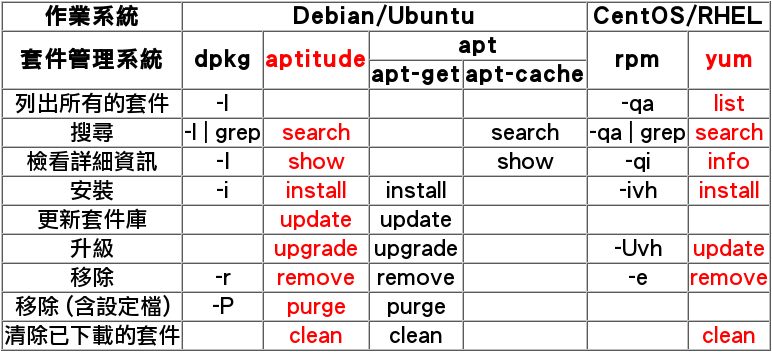

# 完全用 GNU/Linux 工作

## 04. 套件管理 (Package Management)

有了網路我們就可以開始安裝套件，但要怎麼安裝套件也是門大學問，而且在不同的 [GNU/Linux 發行版本 (Distribution)](http://zh.wikipedia.org/wiki/Linux%E5%8F%91%E8%A1%8C%E7%89%88) 中所使用的[套件管理系統 (Package Management System)](http://en.wikipedia.org/wiki/Package_management_system) 也不同。Debian 血統上常用的有 dpkg, apt 和 aptitude，Red Hat 血統上常用的有 rpm 和 yum。(圖形界面中也有不少套件管理員可使用，在此凍仁就不多加贅述)。

這些指令與前文 ([03. 網路設定](03.network-setting.md)) 提到的套件庫 (package reopsiroty) 一詞是息息相關的，我們只需在本機下達安裝某套件的指令，它即會從網路上的套件庫下載並安裝套件；但前題是必須知道正確的套件名稱才行！其套件管理不外乎就是在做套件的**搜尋**、**安裝**、**升級**跟**移除**。

<!--
<table cols="7" cellspacing="0" border="1"> <colgroup ></colgroup> <colgroup ></colgroup> <colgroup span="2" ></colgroup> <colgroup ></colgroup> <colgroup ></colgroup> <colgroup ></colgroup>
	<tbody>
		<tr>
			<th align="CENTER" valign="MIDDLE">作業系統</th>
			<th colspan="4" align="CENTER" valign="MIDDLE">Debian/Ubuntu</th>
			<th colspan="2" align="CENTER" valign="MIDDLE">CentOS/RHEL</th>
		</tr>
		<tr>
			<th rowspan="2" align="CENTER" valign="MIDDLE">套件管理系統</th>
			<th rowspan="2" align="CENTER" valign="MIDDLE">dpkg</th>
			<th rowspan="2" align="CENTER" valign="MIDDLE">aptitude</th>
			<th colspan="2" align="CENTER" valign="MIDDLE">apt</th>
			<th rowspan="2" align="CENTER" valign="MIDDLE">rpm</th>
			<th rowspan="2" align="CENTER" valign="MIDDLE">yum</th>
		</tr>
		<tr>
			<th align="CENTER" valign="MIDDLE">apt-get</th>
			<th align="CENTER" valign="MIDDLE">apt-cache</th>
		</tr>
		<tr>
			<td align="CENTER" valign="MIDDLE">列出所有的套件</td>
			<td align="CENTER" valign="MIDDLE">-l</td>
			<td align="CENTER" valign="MIDDLE"> </td>
			<td align="CENTER" valign="MIDDLE"> </td>
			<td align="CENTER" valign="MIDDLE"> </td>
			<td align="CENTER" valign="MIDDLE">-qa</td>
			<td align="CENTER" valign="MIDDLE">list</td>
		</tr>
		<tr>
			<td align="CENTER" valign="MIDDLE">搜尋</td>
			<td align="CENTER" valign="MIDDLE">-l | grep</td>
			<td align="CENTER" valign="MIDDLE">search</td>
			<td align="CENTER" valign="MIDDLE"> </td>
			<td align="CENTER" valign="MIDDLE">search</td>
			<td align="CENTER" valign="MIDDLE">-qa | grep</td>
			<td align="CENTER" valign="MIDDLE">search</td>
		</tr>
		<tr>
			<td align="CENTER" valign="MIDDLE">檢看詳細資訊</td>
			<td align="CENTER" valign="MIDDLE">-I</td>
			<td align="CENTER" valign="MIDDLE">show</td>
			<td align="CENTER" valign="MIDDLE"> </td>
			<td align="CENTER" valign="MIDDLE">show</td>
			<td align="CENTER" valign="MIDDLE">-qi</td>
			<td align="CENTER" valign="MIDDLE">info</td>
		</tr>
		<tr>
			<td align="CENTER" valign="MIDDLE">安裝</td>
			<td align="CENTER" valign="MIDDLE">-i</td>
			<td align="CENTER" valign="MIDDLE">install</td>
			<td align="CENTER" valign="MIDDLE">install</td>
			<td align="CENTER" valign="MIDDLE"> </td>
			<td align="CENTER" valign="MIDDLE">-ivh</td>
			<td align="CENTER" valign="MIDDLE">install</td>
		</tr>
		<tr>
			<td align="CENTER" valign="MIDDLE">更新套件庫</td>
			<td align="CENTER" valign="MIDDLE"> </td>
			<td align="CENTER" valign="MIDDLE">update</td>
			<td align="CENTER" valign="MIDDLE">update</td>
			<td align="CENTER" valign="MIDDLE"> </td>
			<td align="CENTER" valign="MIDDLE"> </td>
			<td align="CENTER" valign="MIDDLE"> </td>
		</tr>
		<tr>
			<td align="CENTER" valign="MIDDLE">升級</td>
			<td align="CENTER" valign="MIDDLE"> </td>
			<td align="CENTER" valign="MIDDLE">upgrade</td>
			<td align="CENTER" valign="MIDDLE">upgrade</td>
			<td align="CENTER" valign="MIDDLE"> </td>
			<td align="CENTER" valign="MIDDLE">-Uvh</td>
			<td align="CENTER" valign="MIDDLE">update</td>
		</tr>
		<tr>
			<td align="CENTER" valign="MIDDLE">移除</td>
			<td align="CENTER" valign="MIDDLE">-r</td>
			<td align="CENTER" valign="MIDDLE">remove</td>
			<td align="CENTER" valign="MIDDLE">remove</td>
			<td align="CENTER" valign="MIDDLE"> </td>
			<td align="CENTER" valign="MIDDLE">-e</td>
			<td align="CENTER" valign="MIDDLE">remove</td>
		</tr>
		<tr>
			<td align="CENTER" valign="MIDDLE">移除 (含設定檔)</td>
			<td align="CENTER" valign="MIDDLE">-P</td>
			<td align="CENTER" valign="MIDDLE">purge</td>
			<td align="CENTER" valign="MIDDLE">purge</td>
			<td align="CENTER" valign="MIDDLE"> </td>
			<td align="CENTER" valign="MIDDLE"> </td>
			<td align="CENTER" valign="MIDDLE"> </td>
		</tr>
		<tr>
			<td align="CENTER" valign="MIDDLE">清除已下載的套件</td>
			<td align="CENTER" valign="MIDDLE"> </td>
			<td align="CENTER" valign="MIDDLE">clean</td>
			<td align="CENTER" valign="MIDDLE">clean</td>
			<td align="CENTER" valign="MIDDLE"> </td>
			<td align="CENTER" valign="MIDDLE"> </td>
			<td align="CENTER" valign="MIDDLE">clean</td>
		</tr>
	</tbody>
</table>
-->

▲ Debian/Ubuntu, CentOS/RHEL 上常見套件管理指令。

### 舉例說明

1. 搜尋 (毋需管理者權限)。

	    # Debian/Ubuntu
	    aptitude search  <package_name>
	    apt-cache search <package_name>
	    dpkg -l | grep   <package_name>

	    # CentOS/RHEL
	    yum search		<package_name>
	    rpm -qa | grep	<package_name>

2. 安裝。

	    # Debian/Ubuntu
	    sudo aptitude install <package_name>
	    sudo apt-get install  <package_name>
	    sudo dpkg -i		  <package_name>

	    # CentOS/RHEL
	    sudo yum install	<package_name>
	    sudo rpm -ivh		<package_name>

3. 升級。

	    # Debian/Ubuntu
	    sudo aptitude upgrade <package_name>
	    sudo apt-get upgrade  <package_name>

	    # CentOS/RHEL
	    sudo yum update	<package_name>
	    sudo rpm -Uvh	<package_name>

4. 移除。

        # Debian/Ubuntu
	    sudo aptitude remove <package_name>
	    sudo apt-get remove	 <package_name>
	    sudo dpkg -r		 <package_name>

	    # CentOS/RHEL
	    sudo yum remove	<package_name>
	    sudo rpm -e		<package_name>

話說套件管理的指令也不算少，凍仁強烈建議大家使用 aptitude 及 yum 來管理套件，其最棒的是它們會自行處理套件間的相依性，可減輕不少負擔。至於參數的部份，請先牢記 search, install, update, upgrade 和 remove。相信到這裡我們已可完成大部份的事情了。

### 資料來源

- [Linux上的套件管理 (rpm, dpkg, yum, apt) | 八拉八拉在 blah blah ...](http://blog.roodo.com/schonrosemary/archives/4362693.html)
- [apt 用法教學 - Tsung's Blog](http://blog.longwin.com.tw/2005/05/use_apt/)
- [APT 的 clean 與 autoclean 差異 - Tsung's Blog](http://blog.longwin.com.tw/2012/05/apt-clean-autoclean-diff-2012/)
- [RPM 與 SRPM 軟體管理員 | 鳥哥的 Linux 私房菜](http://linux.vbird.org/linux_basic/0520rpm_and_srpm.php)
- [Dpkg 常用指令操作快速参考 — LinuxTOY](http://linuxtoy.org/archives/dpkg_reference.html)
- [Official Repositories (正體中文) - ArchWiki](https://wiki.archlinux.org/index.php/Official_Repositories_(%E6%AD%A3%E9%AB%94%E4%B8%AD%E6%96%87)

