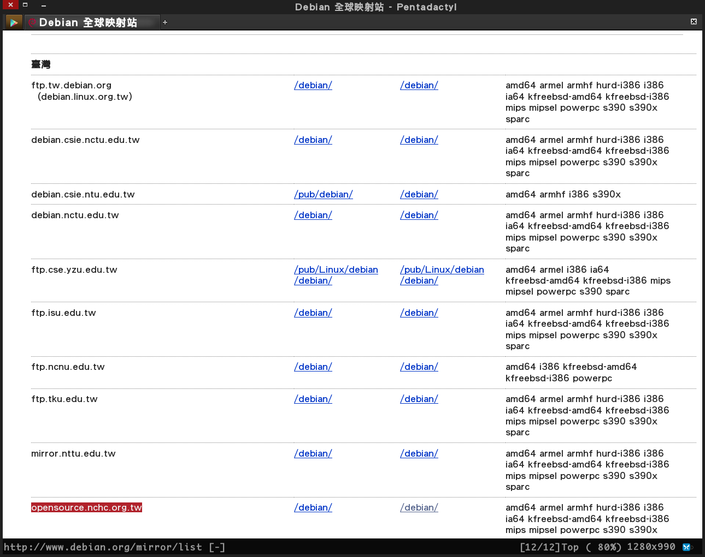

# 完全用 GNU/Linux 工作
 
## 05. 套件庫及鏡像站

每個 GNU/Linux 都有屬於它的哲學及用途，以下就讓凍仁簡述一下自己的看法。

- [Debian](http://zh.wikipedia.org/wiki/Debian): 堅守[自由軟體](http://zh.wikipedia.org/wiki/%E8%87%AA%E7%94%B1%E8%BB%9F%E9%AB%94)精神，擁有嚴謹的非營利組織團隊，支援眾多平台，例如 [NOKIA N900](https://zh.wikipedia.org/wiki/%E8%AF%BA%E5%9F%BA%E4%BA%9A_N900) 及 [Raspberry Pi](https://zh.wikipedia.org/wiki/%E6%A0%91%E8%8E%93%E6%B4%BE)。主要分成穩定版 (stable)、測試版 (testing)、及不穩定版 (unstable)。
- [Ubuntu](http://zh.wikipedia.org/wiki/Ubuntu): Debian 的不穩定版分支，其設計目的為使用者導向，易上手且驅動支援較完整，主要分成桌面版 (desktop) 及 伺服器版 (server)，並於每兩年發布長期支援版本 (LTS)。
- [RHEL](http://zh.wikipedia.org/wiki/Red_Hat_Enterprise_Linux): 由 Red Hat 公司釋出，其主要對象為追求穩定的公司行號。
- [CentOS](http://zh.wikipedia.org/wiki/CentOS): 依照[開放原始碼](https://zh.wikipedia.org/wiki/%E9%96%8B%E6%94%BE%E5%8E%9F%E5%A7%8B%E7%A2%BC)所釋出的 RHEL，也可說是社群版的 RHEL，但不包含一些封閉的軟體。

### 擴充套件庫

由於每家的設計取向不同，有些好用的第三方套件並不會 (或來不及) 包進預設的套件庫，這時我們可以自行擴充並藉此減少自行編譯的時間。這樣除了可以減少安裝所需的時間，也可達到環保的效益 (請大家為住在南極的企鵝先生多著想一下)。

#### 1. Debian

在 Debian 裡我們只需在 sources.list 的最底下加入欲擴充的套件來源 (source) 即可。

	$ sudo vi /etc/apt/sources.list
	......

	# - Multimedia.
	#  - master
	#deb http://www.deb-multimedia.org wheezy main non-free
	#  - mirrors of Taiwan.
	deb ftp://ftp.ubuntu-tw.org/mirror/debian-multimedia wheezy main non-free
	
	# - Mate Desktop Environment.
	#  - master 
	#deb http://repo.mate-desktop.org/debian wheezy main
	# - mirrors of Taiwan.
	deb ftp://ftp.ubuntu-tw.org/mirror/mate-desktop/debian wheezy main
	
	# - Iceweasel.
	deb http://mozilla.debian.net/ wheezy-backports iceweasel-release
	
	# - hime
	deb http://debian.luna.com.tw/wheezy ./

#### 2. Ubuntu

在 Ubuntu 上除了可使用各專案提供的套件來源，還可上官方的 [Launchpad](https://launchpad.net/) 平台尋找可用的來源，若 Launchpad 上有適合的套件來源，我們除了編輯 sources.list 以外，還可使用 add-apt-repository 指令來新增。

	# gcin
	$ sudo add-apt-repository ppa:elleryq/gcin

#### 3. CentOS

CentOS 預設的套件庫並不及 Debian 來的完整 (例如 htop, drush ...) ，但我們還有第三方來源可以使用。著名的有 [RPMForge](http://wiki.centos.org/zh-tw/AdditionalResources/Repositories/RPMForge) 及 [EPEL](http://fedoraproject.org/wiki/EPEL)，請先行安裝 RPMforge 再安裝 EPEL，切忌。

##### RPMforge

下載 RPMForge 安裝檔。

	# 64 bit
	$ wget http://pkgs.repoforge.org/rpmforge-release/rpmforge-release-0.5.3-1.el6.rf.x86_64.rpm
	
	# 32 bit
	$ wget http://pkgs.repoforge.org/rpmforge-release/rpmforge-release-0.5.3-1.el6.rf.i686.rpm

匯入 DAG 的 RPM GPG 金鑰。

	$ sudo rpm --import http://apt.sw.be/RPM-GPG-KEY.dag.txt

驗證套件，查看此安裝是否為 DAG 所簽證，就算是在 Linux 上也是得避免安裝來路不名的軟體。

	$ rpm -K rpmforge-release-0.5.2-2.el6.rf.*.rpm

安裝。

	$ sudo rpm -i rpmforge-release-0.5.2-2.el6.rf.*.rpm

現在可以使用 yum 來安裝 RPMForge 來源提供的套件了，例如 htop。若還是不夠用，可以連 EPEL 一併安裝。

	$ sudo yum install htop

##### EPEL

下載 EPEL 安裝檔。

	$ wget http://mirror-fpt-telecom.fpt.net/fedora/epel/6/i386/epel-release-6-8.noarch.rpm

安裝 **EPEL**。

	$ sudo rpm -ivh epel-release-6-8.noarch.rpm

	# noarch 表示支援各種硬體平台。

註：CentOS 上也有相對於 Debian 的 sources.list，請參照 /etc/yum.repos.d/ 底下的 *.repo。

### 鏡像站 (Mirror)

眼尖的客官不難發現上方 Debian 的 sources.list 設定檔中藏著 **mirror** 一關鍵字，它就是先前提到的鏡像站，它會不定期同步主站 (Master) 上的套件庫並藉此達到分流的效果。而通常我們可以在官網上找到位於各國的鏡像站列表

▲ [Debian 全球映射站](http://www.debian.org/mirror/list)網站截圖。

系統預載的鏡像站不見得是最適合我們的，其連線速度會依照地域及線路狀況而有所不同，我們可以透過 netselect (Debian) 及 software-properties (Ubuntu) ... 等工具來篩選出最適合的鏡像站，詳情請參考以下連結。

- [APT HOWTO (Obsolete Documentation) - 基礎設定](http://www.debian.org/doc/manuals/apt-howto/ch-basico.zh-tw.html)
- [使用 software-properties 管理 APT 套件來源清單 - FlossDoc](http://wiki.ubuntu.hk/w/Manage_APT_package_source_list_with_software-properties)
- [Ubuntu Linux 挑選最佳的 Mirror Site (APT Repository) - Tsung's Blog](http://blog.longwin.com.tw/2011/02/ubuntu-mirror-site-repository-2011/)

### Reference

相關連結：

- [Debian 無痛起步法: 了解 Debian 系統的哲學](http://people.debian.org.tw/~moto/debian/DebianLessPain/Debian-Install-Guide-5.html)
- [套件庫來源 - Ubuntu 正體中文 Wiki](http://wiki.ubuntu-tw.org/index.php?title=%E5%A5%97%E4%BB%B6%E5%BA%AB%E4%BE%86%E6%BA%90)

資料來源：

- [Install and Enable RPMForge Repository in RHEL/CentOS 6, 5, 4](http://www.tecmint.com/install-and-enable-rpmforge-repository-in-rhel-centos-6-5-4/)
- [CentOS / RHEL / Scientific Linux 6 Enable & Install EPEL Repo](http://www.cyberciti.biz/faq/fedora-sl-centos-redhat6-enable-epel-repo/)
- [Linux Software Repositories – Google](http://www.google.com/linuxrepositories/)

