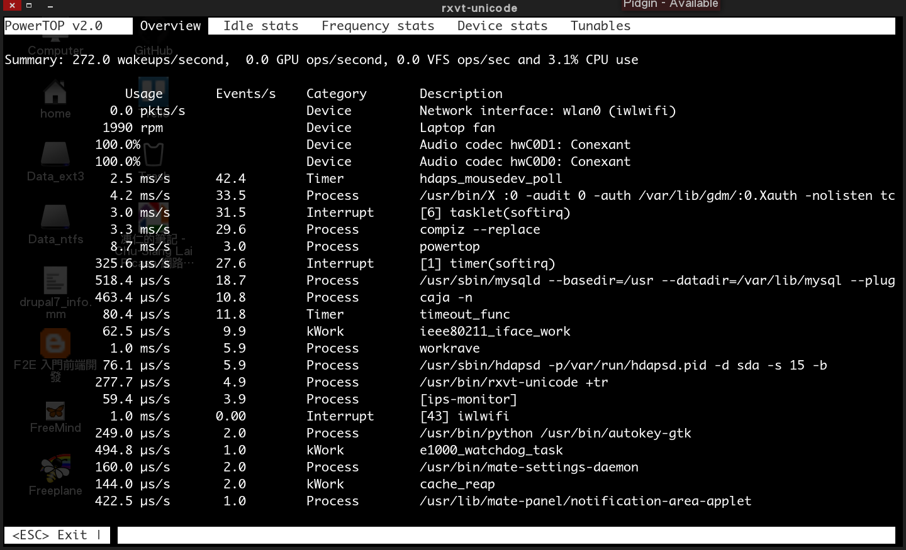
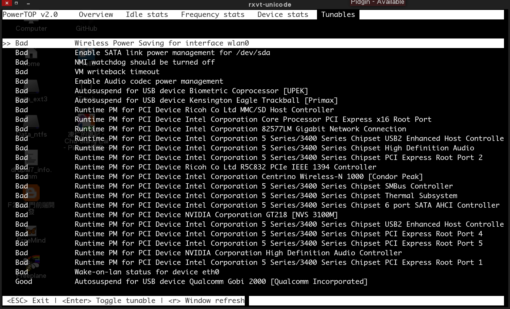
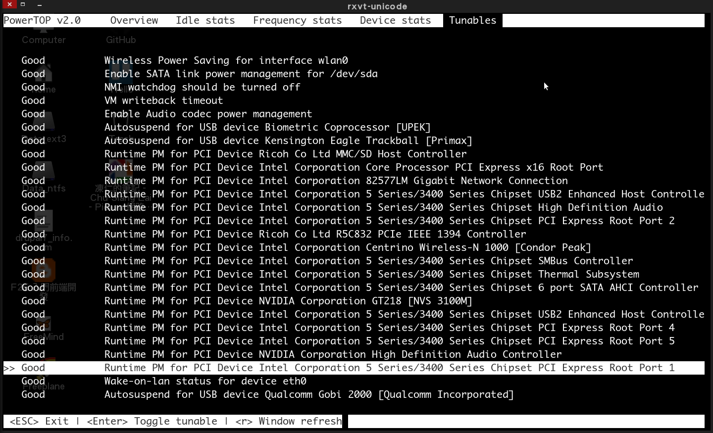

# 完全用 GNU/Linux 工作

## 08. 電源管理 (PowerTOP)

[PowerTOP](https://01.org/powertop/) 是個分析、監控電力消秏的節能工具程式，它是由 Intel 於 2007 年以 [GPLv2](http://www.gnu.org/licenses/gpl-2.0.html) 授權釋出的開放原始碼專案。我們可以使用它找出 GNU/Linux 上秏電的套件，並透過停用不必要的功能以達到省電的效果，是筆記型電腦 (Laptop) 必裝的實用工具。

▲ PowerTOP 的起始畫面。

開始前請先安裝 powertop。
	
	# Debian, Ubuntu
	$ sudo aptitude install powertop

	# CentOS, RHEL, Fedora
	$ sudo yum install powertop

	# Arch Linux
	$ sudo pacman -S powertop

請使用方向鍵 **← → ** 切換至 **Tunables** 分頁，並使用 **↑ ↓** 上下移動，於欲調校的項目按下 **Enter** 進行調校，當所有狀態顯示為 Good 後即可按下 **q** 離開。

▲ 調校前的 **Tunables**。

▲ 調校後的 **Tunables**。

PowerTOP 本身並無儲存功能，但我們可以藉由 ``powertop '--html'`` 產生的報告來調校系統，甚至於開機時載入這些設定。

	$ sudo powertop --html
	Loaded 58 prior measurements
	Cannot load from file /var/cache/powertop/saved_parameters.powertop
	Preparing to take measurements
	Measuring 1 time(s) for 20 seconds each
	PowerTOP outputing using base filename powertop-20130915-231821.html

▲ 此報告將依個人環境而有所不同，其各項目的詳細說明可參考 [Power saving - ArchWiki](https://wiki.archlinux.org/index.php/Power_saving) 一文。

接著將調校的指令貼到一個 shell script 打包起來。

	$ sudo vi /usr/local/bin/powersave
	#!/bin/bash
	# PowerTop conifg for ThinkPad T410 on Debian Wheezy.
	
	# Wireless Power Saving for interface wlan0
	iw dev wlan0 set power_save off
	
	# Enable SATA link power management for /dev/sda
	echo 'min_power' > '/sys/class/scsi_host/host0/link_power_management_policy';
	
	# NMI watchdog should be turned off
	echo '0' > '/proc/sys/kernel/nmi_watchdog';
	
	# VM writeback timeout
	echo '1500' > '/proc/sys/vm/dirty_writeback_centisecs';
	
	# Enable Audio codec power management	
	echo '1' > '/sys/module/snd_hda_intel/parameters/power_save';
	
	# Autosuspend for USB device Biometric Coprocessor [UPEK]	
	echo 'auto' > '/sys/bus/usb/devices/1-1.3/power/control';
	
	# Runtime PM for PCI Device Ricoh Co Ltd MMC/SD Host Controller
	echo 'auto' > '/sys/bus/pci/devices/0000:0d:00.0/power/control';
	
	# Runtime PM for PCI Device Intel Corporation Core Processor PCI Express x16 Root Port	
	echo 'auto' > '/sys/bus/pci/devices/0000:00:01.0/power/control';
	
	# Runtime PM for PCI Device Intel Corporation 82577LM Gigabit Network Connection	
	echo 'auto' > '/sys/bus/pci/devices/0000:00:19.0/power/control';
	
	# Runtime PM for PCI Device Intel Corporation 5 Series/3400 Series Chipset USB2 Enhanced Host Controller	
	echo 'auto' > '/sys/bus/pci/devices/0000:00:1a.0/power/control';
	
	# Runtime PM for PCI Device Intel Corporation 5 Series/3400 Series Chipset High Definition Audio	
	echo 'auto' > '/sys/bus/pci/devices/0000:00:1b.0/power/control';
	
	# Runtime PM for PCI Device Intel Corporation 5 Series/3400 Series Chipset PCI Express Root Port 4	
	echo 'auto' > '/sys/bus/pci/devices/0000:00:1c.3/power/control';
	
	# Runtime PM for PCI Device Ricoh Co Ltd R5C832 PCIe IEEE 1394 Controller	
	echo 'auto' > '/sys/bus/pci/devices/0000:0d:00.3/power/control';
	
	# Runtime PM for PCI Device Intel Corporation Centrino Wireless-N 1000 [Condor Peak]	
	echo 'auto' > '/sys/bus/pci/devices/0000:03:00.0/power/control';
	
	# Runtime PM for PCI Device Intel Corporation 5 Series/3400 Series Chipset SMBus Controller	
	echo 'auto' > '/sys/bus/pci/devices/0000:00:1f.3/power/control';
	
	# Runtime PM for PCI Device Intel Corporation 5 Series/3400 Series Chipset Thermal Subsystem	
	echo 'auto' > '/sys/bus/pci/devices/0000:00:1f.6/power/control';
	
	# Runtime PM for PCI Device Intel Corporation 5 Series/3400 Series Chipset 6 port SATA AHCI Controller	
	echo 'auto' > '/sys/bus/pci/devices/0000:00:1f.2/power/control';
	
	# Runtime PM for PCI Device NVIDIA Corporation GT218 [NVS 3100M]	
	echo 'auto' > '/sys/bus/pci/devices/0000:01:00.0/power/control';
	
	# Runtime PM for PCI Device Intel Corporation 5 Series/3400 Series Chipset USB2 Enhanced Host Controller	
	echo 'auto' > '/sys/bus/pci/devices/0000:00:1d.0/power/control';
	
	# Runtime PM for PCI Device Intel Corporation 5 Series/3400 Series Chipset PCI Express Root Port 1
	echo 'auto' > '/sys/bus/pci/devices/0000:00:1c.0/power/control';
	
	# Runtime PM for PCI Device Intel Corporation 5 Series/3400 Series Chipset PCI Express Root Port 5	
	echo 'auto' > '/sys/bus/pci/devices/0000:00:1c.4/power/control';
	
	# Runtime PM for PCI Device NVIDIA Corporation High Definition Audio Controller	
	echo 'auto' > '/sys/bus/pci/devices/0000:01:00.1/power/control';
	
	# Runtime PM for PCI Device Intel Corporation 5 Series/3400 Series Chipset PCI Express Root Port 2	
	echo 'auto' > '/sys/bus/pci/devices/0000:00:1c.1/power/control';
	
	# Wake-on-lan status for device eth0
	#ethtool -s eth0 wol d;

給予執行權限。

	$ sudo chmod +x /usr/local/bin/powersave

因調校指令皆需管理者權限才可執行，若想省下打密碼的功夫可參考 [Firestarter 開機甭再次輸入密碼](http://note.drx.tw/2008/02/firestarter-no-password.html) 一文修改。

	$ sudo visudo
	......
	jonny   ALL= NOPASSWD:/usr/local/bin/powersave

現在開機時只需使用 ``sudo powersave`` 即可手動切換至**省電模式**。

若想加入開機自動啟動可以參考 [安裝 indicator-virtualbox on Ubuntu 12.04 | 4. 加入開機自動啟動](http://note.drx.tw/2012/09/install-indicator-virtualbox-on-ubuntu-12.04.html#autostart) 一文或使用較進階的 [udev](https://wiki.archlinux.org/index.php/Udev_rules) 及 [sysctl](https://wiki.archlinux.org/index.php/Sysctl)。

※ 註：請依個人需求自行調整，若造成系統不穩還請自行斟酌。

### 資料來源：

- [PowerTOP - Wikipedia](http://en.wikipedia.org/wiki/PowerTOP)
- [Powertop - ArchWiki](https://wiki.archlinux.org/index.php/Powertop)
- [2.2. PowerTOP - Red Hat Customer Portal](https://access.redhat.com/site/documentation/zh-TW/Red_Hat_Enterprise_Linux/6/html/Power_Management_Guide/PowerTOP.html)
- [冷靜: Powertop](http://bluequiet.blogspot.tw/2010/01/blog-post.html)

