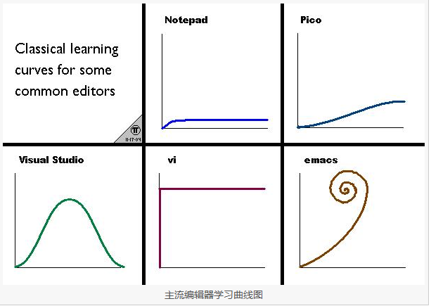

# 完全用 GNU/Linux 工作

## 11. Hacking Vim

[Vim](http://zh.wikipedia.org/wiki/Vim) 是功能完整且強大的文字編輯器 (Text Editor，以下簡稱 Editor)，相信接觸過 GNU/Linux 的伙伴都曾接觸過。相信不少人對於它的印象就如同 COSCUP 2011 的經典名句「第一次用 vi 時進的去出不來」一樣，但只要事先做過些功課，便可習得第一成的功力，待大成後其帶來的便利性是其他的 Editor 難以取代的！

▲ Vi 學習曲線圖。

我們可以在 **Vim 使用手冊** (於終端機中輸入 `vimtutor` 即可) 以及網際網路上取得不少資源。

<iframe src="http://www.slideshare.net/slideshow/embed_code/15635368" width="427" height="356" frameborder="0" marginwidth="0" marginheight="0" scrolling="no" style="border:1px solid #CCC;border-width:1px 1px 0;margin-bottom:5px" allowfullscreen> </iframe> 
 <strong> <a href="https://www.slideshare.net/BruceLi2/008-vim" title="008 vim超基礎入門" target="_blank">008 vim超基礎入門</a> </strong> from <strong><a href="http://www.slideshare.net/BruceLi2" target="_blank">Bruce Li</a></strong> 

▲ [vgod 匯整的 Vim 入門圖解說明](http://blog.vgod.tw/2009/12/08/vim-cheat-sheet-for-programmers/) 

從**土法煉鋼**、**快速移動**、**加強技巧**、**使用套件 (plugins)**到**打造屬於自己的 Vim** 前後得花了不少的時間及心力，但我們可以在各個平台 (Android, GNU/Linux, iOS, Mac OSX, Windows)、軟體 (Bash, Chrome, Firefox, MySQL, Python, vifm, [Visual Studio](http://visualstudiogallery.msdn.microsoft.com/59ca71b3-a4a3-46ca-8fe1-0e90e3f79329 "VsVim 擴充功能"), w3m) 以及網路服務 (Facebook, Gmail) 中發現它的影子，是個習得一招半式便可打遍天下無敵手的 Editor，對凍仁而言它是個很棒的投資！

部份的發行版本只會預載 [Vi](http://zh.wikipedia.org/wiki/Vi) 而沒有 Vim，這時請手動安裝它。

	# Debian, Ubuntu on Gnome, Unity
	$ sudo aptitude install vim-gnome

	# Debian, Ubuntu on KDE, Evilwm
	$ sudo aptitude install vim-gtk

	# CentOS, Fedora
	$ sudo yum install vim-X11

### 凍仁 vim 環境設定 (vimrc)

如想取得凍仁完整的 vim 環境設定，請參考 凍仁的 GitHub。

    # 下載凍仁的環境設定。  
    $ git clone https://github.com/chusiang/vimrc.git  
      
    # 切換目錄。  
    $ cd vimrc/  
      
    # 備份原設定。  
    $ make backup  
      
    # 安裝。  
    $ make install  
      
    # 開啟 Vim。  
    $ vim  
      
    # 安裝各式的 vim 套件。  
    :NeobundleInstall  

以下設定可寫入 $HOME/.vimrc，這樣下次啟動 Vim 時設定才會存在。

#### 更換 fu 怖景主題

    colorscheme fu  

#### 使用 F5, F6 開啟當前編輯的網頁

    " - local.drx.tw (PHP)  
    nnoremap <F5> :silent update<Bar>silent !firefox %:p:s?\(.\{-}/\)\{4}?http://local.drx.tw/?<CR>  
      
    " - current file (Ex: html, txt)   
    nnoremap <F6> :silent update<Bar>silent !firefox %:p &<CR>  

### 常用指令 

#### 內文取代

- s: 取代。
- g: 對該行所有的字元進行處理。
- c: 檢查。

全文取代。

	:%s/old_world/new_world/gc

取代第 5 ~ 10 行。

	:5,10s/old_world/new_world/gc

#### 啟用貼上模式

若有設定自動縮排 (set hls)，在貼上程式碼時會有走山的情形，這時可以先切換成貼上模式再貼上。

	:set paste

#### 比對檔案差異

稱職的系統管理者是勤於備份的，在更動設定檔 (conf) 前一定會先複製一份。在眾多版本中的難以使用肉眼查覺出差異，這時可用 diff, Vim 或 Meld 來比對。

	# 在 Vim 底下時，請使用 :diffsplit。
	$ vi <file1>
	...
	:diffsplit <file2>

	# 在 bash 底下時，請使用 vimdiff。
	$ vimdiff <file1> <file2>

#### 將內容轉成 HTML

`:TOhtml` 會產生與 Vim 上一模一樣的 html，對於想用網頁秀出程式碼的人是必備的功能 ([範例](http://formatvim.sourceforge.net/samples/allfolds.html)) 。

	$ vi /usr/local/bin/powersave
	......
	:TOhtml

有非常多的快捷鍵、設定及指令可以使用是件令人開心的事，但這同時也提高不少的門壏。建議初學者可以先套前人的 vimrc，並試著修改它，不懂的部份只要 Google 一下相信可以找到不少的解答。

Happy hacking !

## 相關連結：

- [008 vim超基礎入門 | 小 B](http://www.slideshare.net/BruceLi2/008-vim)
- [心得：使用 Vim 編輯器的第一年](http://joe-dev.blogspot.tw/2012/10/vim.html)
- [給程式設計師的 Vim 入門圖解說明 | vgod's blog](http://blog.vgod.tw/2009/12/08/vim-cheat-sheet-for-programmers/) 
- [Vim 功能介紹 | 小惡魔 - 電腦技術 - 工作筆記 - AppleBOY](http://blog.wu-boy.com/2006/12/vim-%E5%8A%9F%E8%83%BD%E4%BB%8B%E7%B4%B9/)
- [鳥哥的 Linux 私房菜 -- vim 程式編輯器](http://linux.vbird.org/linux_basic/0310vi.php)
- [大家來學VIM（一個歷久彌新的編輯器）](http://www.study-area.org/tips/vim/)
