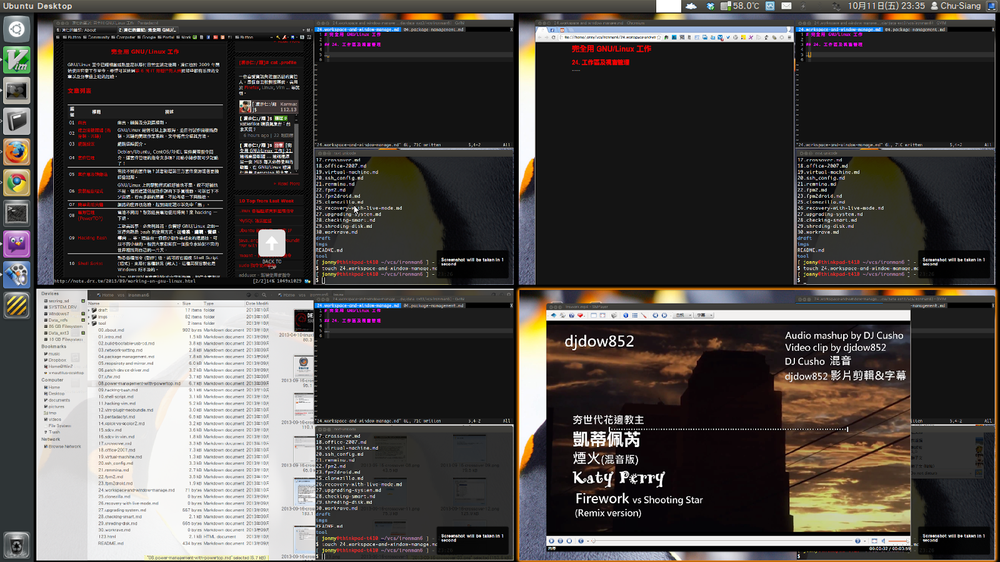
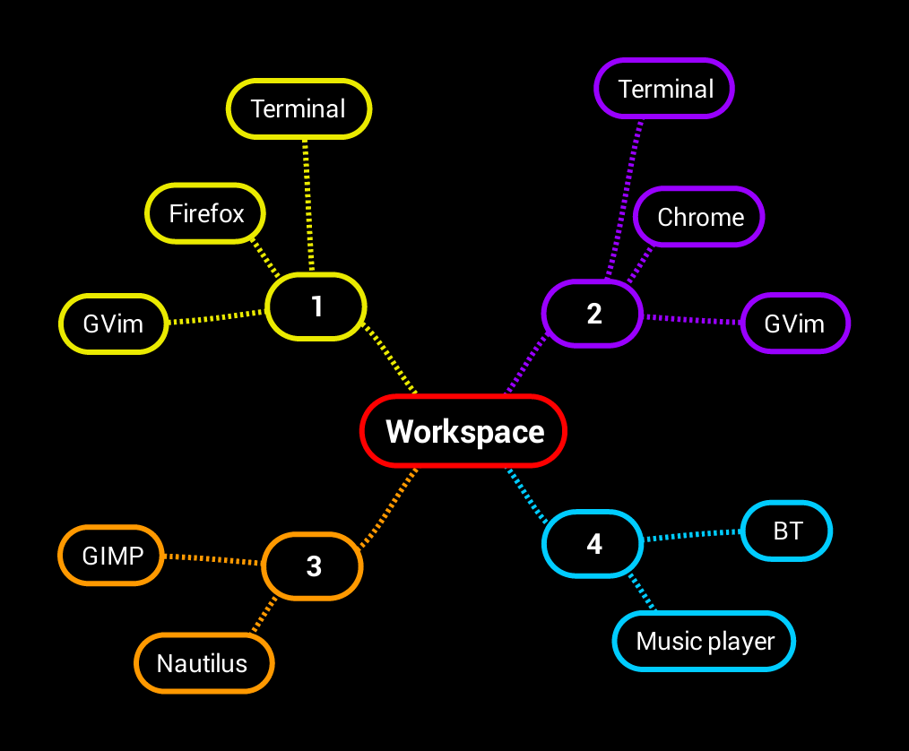
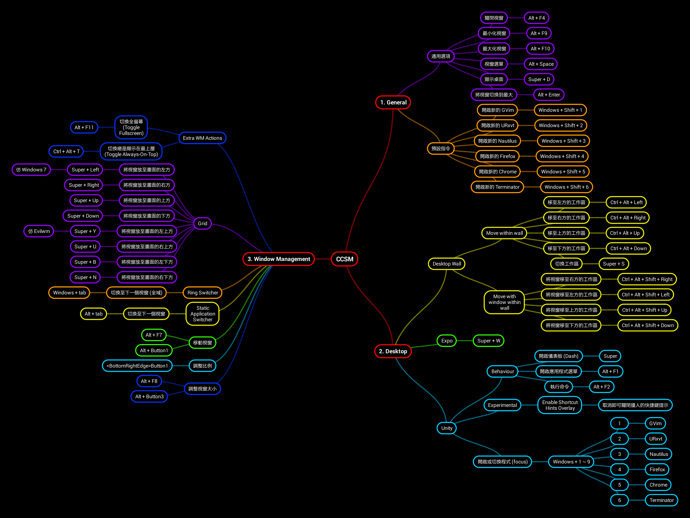
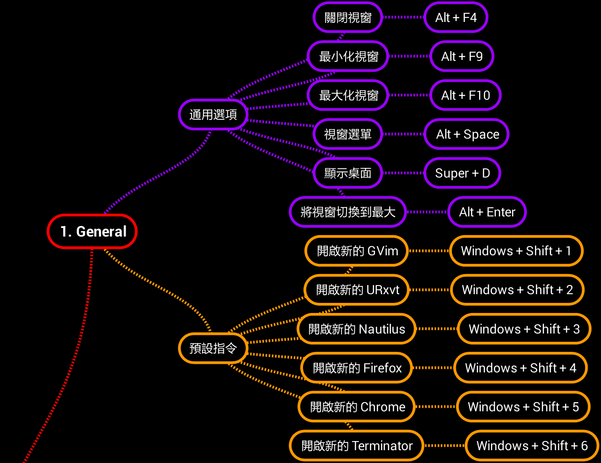

# 完全用 GNU/Linux 工作

## 24. 視窗管理及工作區 (上)

自從 2007 年開始接觸 Ubuntu 7.04 以後，凍仁於 x86 電腦上的使用習慣有了大大的改變。與 Windows 相比，除了有更多可以操控視窗的快捷鍵外，更多了工作區的概念。這讓生活在視窗之海的凍仁解了套，也想說一句「我回不去了」，再也不想回到綁手綁腳的 Windows 上了。

▲ 圖 1: 2 x 2 的工作區。

### 工作區

工作區的概念就好比視窗的群組，GNU/Linux (Gnome, KDE, LxDE), Android, iOS, Mac OSX, Windows 8 上都有類似的設計。以下為凍仁對各個工作區的規劃。

- 工作區 1 (左上)：主要工作區，以 Firefox, GVim, Terminal 為主。
- 工作區 2 (右上)：次要工作區，查詢資料及臨時交辨事項為主。
- 工作區 3 (左下)：檔案管理員、虛擬機器、修圖 … 等。
- 工作區 4 (右下)：即時通訊、多媒體、畫面截圖 … 等。

▲ 圖 2: 工作區對照圖 (請與圖 1 對照)。

由於是 **2 x 2** 加上**工作區 1** 為主要工作區的規劃，大部份都是在**工作區 1, 2** 和**工作區 1,3** 切換比較多，故**工作區 4** 則規劃成使用頻率較低的程式。

### 視窗管理

試過各種 GNU/Linux 上的 [Window Manager](http://zh.wikipedia.org/wiki/X%E8%A6%96%E7%AA%97%E7%AE%A1%E7%90%86%E5%99%A8) 後，凍仁最後選擇了比 [Metacity](http://zh.wikipedia.org/wiki/Metacity) 還強大的 [Compiz](http://zh.wikipedia.org/wiki/Compiz)。但由於之前必須於 Windows 7, Ubuntu ([Unity](http://zh.wikipedia.org/wiki/Unity)) 和 Debian (Compiz) 切換的關係，預設的快捷鍵已不符需求，好在 Compiz 的彈性夠大，讓凍仁可以統一操作模式，以降低切換時的不適。

▲ 圖 3: 此為凍仁使用 CCSM (CompizConfig Settings Manager) 所做設定。

#### 一般 (General)

▲ 圖 4: General 分類的設定。

##### 通用選項

基本上與 Metacity 的配置相同，**顯示桌面**則改成與 Windows 相同的快捷鍵 Window + D，而**將視窗切換到最大**則是參考 PieTTY 的全螢幕設定，比起 Alt + F10 的組合鍵 Alt + Enter 順手多了。

##### 預設指令

此為 Compiz 給予使用者新增快捷鍵的地方，共可設定 12 組。個人是用它實作**開新應用程式**的功能，以對應 Windows 7 上的功能。

[» 25. 視窗管理及工作區 (下)](25.wm-and-workspace-2.md)
